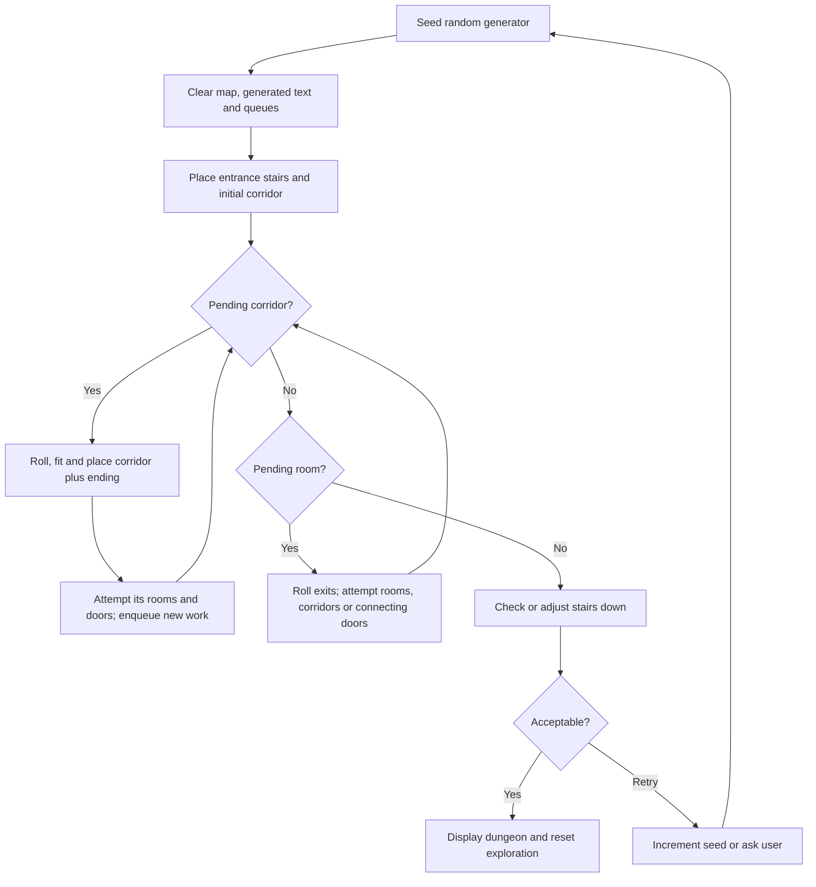

# Dungeon generation

HQ-Map grows a dungeon outward from an entrance. Campaign tables choose corridor
lengths, junctions, room types and contents; geometric checks decide what will
fit. Two queues hold unfinished corridor and room work, with corridors taking
priority. Generation finishes when both queues are empty, followed by a separate
check for stairs down.

This describes the current implementation, including its fallbacks and legacy
behaviour. The main entry point is `makemap()` in [makemap.c](../makemap.c).

## Inputs and representation

The caller supplies the map width and height, entrance coordinates, entrance
direction and random seed. The selected campaign supplies the loaded `.tab`
tables. Options also control whether to add missing stairs, reduce multiple
stairs, and retry maps without a way down.

The geometry uses integer board squares, with X increasing east and Y increasing
north. Screen drawing reverses Y. [map.c](../map.c) holds a grid of pointers into
the `Pice` array. Each `PICE` records its type, facing, rectangular bounds,
feature and text. Several grid cells normally point to the same piece.

The unrotated dimensions in [pice.c](../pice.c) are:

| Piece | Width × height in squares |
| --- | --- |
| Passage section or dead end | 2 × 5 |
| Turn, junction or staircase | 2 × 2 |
| Small, Normal or Hazard room | 5 × 5 |
| Large, Lair or Quest room | 5 × 10 |
| Big room | 10 × 10 |
| Merscha room | 15 × 15 |
| Door or secret door | 1 × 1 |

East/west orientations swap width and height. A door occupies a grid cell and
can replace that cell's previous piece pointer; the underlying room remains in
the piece array. Walls and door artwork are rendering details, rather than a
separate wall-cell grid.

## Overall flow



Fatal placement, table or allocation errors can stop an attempt before the
stairs check. A blocked extension is usually an ordinary end to that branch.

Equivalent high-level pseudocode for the core generator is:

```text
clear grid and piece slots
reset generated-text heap and content numbering
empty passage and room queues
attempt entrance and initial corridor

loop:
    if a passage is queued:
        roll its length, ending and feature
        attempt its extension
        abort only if the attempt reports a fatal error
    else if a room is queued:
        roll its additional doors and expand them
        abort if expansion reports an error
    else:
        return success
```

The queues in [queue.c](../queue.c) are FIFO queues containing copies of pieces.
The algorithm is iterative, but room expansion can immediately construct a
corridor before returning to the queue loop. It is therefore not a uniform
breadth-first traversal of all pieces: any pending corridor work precedes the
next queued room.

## Entrance

`do_start()` attempts to place a 2 × 2 `STAIRS_OUT` piece at the specified
coordinates. It reverses the working direction and requests two passage
sections, a T-junction ending and no passage feature. These initial choices are
fixed; the usual fitting checks can still shorten or alter them.

The initial staircase is inserted directly, rather than being populated through
the `Stairs-Out` contents table. If it cannot fit, this routine can return without
placing it; core success alone is not proof that a useful dungeon was created.

## Corridors and junctions

`do_passage()` combines decisions from three reference tables:

| Table | Decision |
| --- | --- |
| `Passage-Length` | Number of 2 × 5 sections, from zero to three |
| `Passage-End` | Turn, T-junction, Corner, dead end or stairs |
| `Passage-Feature` | Nothing, wandering monsters, one door or two doors |

`test_passage()` checks successive full rectangles and stops at the first
obstruction or boundary. It returns the number that fit. If zero fit,
`do_passage_blocked()` tries to repair the originating junction: for example,
turning a T-junction into a bend or closing an unusable bend. This ends the
extension without normally aborting the whole dungeon.

`test_end()` checks both the ending tile and space for its prospective branches.
A requested left bend can become a right bend; a T-junction can become a single
bend. `Corner` is the internal name for an ending with straight, left and right
continuations, and can be reduced to a T-junction or bend. If the end meets a
compatible existing junction opening, it returns `Ok`: the connection needs no
new ending tile. Otherwise the fallback is a dead end.

For a dead end, `do_passage()` inserts one fewer ordinary section and replaces
that section with a 2 × 5 dead-end piece. Other endings follow the fitted run.
`set_end()` queues the outgoing directions of turns and junctions; stairs and
dead ends enqueue no corridor continuation.

After placement, one or two ordinary doors trigger room attempts. A dead end
whose passage feature is Nothing or Wandering-Monsters instead gets up to two
secret-door rolls, stopping at the first success. At most one secret-door
expansion is requested by this check.

## Room placement and size fallback

`Room-Type` selects the requested room category. The fitting routines in
[test.c](../test.c) enumerate possible placements, count those that fit, then
select one with `get_rand(count) + 1` and repeat the enumeration to locate it.
They consider rectangular orientations by swapping width and height.

For a corridor, candidates are on either side of each section. For an existing
room, candidates are along its front and, where permitted, its sides, in
five-square steps. These are specific tile attachment positions, not every
possible empty rectangle on the map.

If no placement fits, both room-fitting routines use this fallback chain:

```text
Merscha or Big -> Lair -> Hazard -> give up
Quest, Lair or Large -> Hazard -> give up
Small, Normal or Hazard -> give up
```

Consequently, a roll for a large room may produce a smaller **Hazard** room with
hazard contents, rather than merely shrinking the requested room's artwork.
The `Big` geometry exists, but the current `room_type()` validator does not
accept `Big` as a normal successful table result; it should not be assumed to
work simply because the placement code supports it.

`test_pice()` requires all cells of a new rectangle to be inside the map and
unoccupied. `insert_pice()` allocates the first unused piece slot and writes its
pointer into the covered cells; collision checks belong to the calling fitting
routines, not to `insert_pice()` itself.

## Doors and room expansion

After a new room is placed, `set_room_door()` chooses a connecting door along
its rear edge. The room is also queued for later expansion. A Hazard room with
a Trapdoor feature is an exception: it is not queued.

When a room reaches the head of the room queue, `Room-Doors` requests zero, one
or two **additional** ordinary doors. The entrance door already exists. Zero
ordinary doors causes up to three `Secret-Doors` rolls, stopping at the first
success and attempting one secret exit.

Each exit consults `Room-or-Passage`:

1. For Room, attempt an adjacent room using the size fallback above.
2. If that fails, or Passage was selected, look for a corridor attachment.
   The generator attempts corridor growth to its left and right, handling
   blocked sides and adding the connecting room door.
3. If expansion cannot be made, try a door into an already occupied adjacent
   square. This can connect existing parts of the dungeon and create loops.
4. If there is no candidate, the requested exit can disappear without failing
   the entire map.

Similarly, a failed corridor-side room attempt can fall back to a door into an
existing neighbouring piece. Door counts from tables are therefore attempts,
not guaranteed final counts.

The side-exit policy is explicit in `are_room_doors_ok()`. Small/Normal/Hazard
rooms disallow side candidates when their feature is Trapdoor, Chasm or Bridge.
Large/Lair/Quest rooms allow them. Big/Merscha rooms do not. Front candidates
are handled separately, so this predicate does not prohibit every exit.

The existing-piece door searches use local occupancy tests. There is no final
graph search proving that every room is reachable or that every connection is
appropriate for a particular adventure's rules.

## Campaign rolls and contents

[table.c](../table.c) loads the named reference and feature tables.
[rolldice.c](../rolldice.c) evaluates them in two ways:

- `referenz_table()` rolls the table's dice and selects the first entry whose
  upper threshold covers the result. It follows a subtable or returns a
  structural keyword such as `Section2`, `Lair` or `Door1`.
- `make_features()` walks all features in the selected entry, recursively
  evaluating subtables, choosing a visual feature when the piece has none,
  and collecting description text. The first text allocates a `#number` label;
  the resulting text list is terminated with a null pointer.

Contents are assigned as pieces are placed, through functions such as
`normal_features()`, `lair_features()` and `wandering_monsters()`. A combined
entry can supply furniture, monsters and treasure through several subtables.
The number on a map is a generated contents reference, not necessarily a
unique number for every geometric piece.

For example, [sonne/room2.tab](../tables/sonne/room2.tab) rolls 1D12 for corridor
length: 1-2 gives one section, 3-8 gives two, and 9-12 gives three. Its room-type
roll gives Normal on 1-6, Hazard on 7-8, Lair on 9-10 and Quest on 11-12.
These are requested outcomes before fitting. Tables using multiple dice have
the corresponding dice-sum distribution, not equal probability per range.

See [the table authoring guide](TABLE-GUIDE.md) for table syntax and campaign
composition. Changing contents can also change later geometry because table
evaluation and placement share the same random stream.

## Stairs and whole-map retries

The UI wrapper `try_makemap()` in [main.c](../main.c) seeds the random generator,
calls `makemap()`, then applies [stairs.c](../stairs.c):

- With the single-stair option, `delete_stairs()` scans the piece array and
  attempts to reduce stairs. If it reports an existing stair candidate, the
  wrapper accepts the map immediately.
- Otherwise `make_stairs()` accepts an existing `STAIRS_DOWN` or a supported
  room carrying `Stairs_and_Chest`.
- If adding stairs is enabled and none exist, it chooses a candidate by type
  priority: Quest, Lair, Hazard, Normal, then Stairs-Out. Within a type it keeps
  the last candidate encountered in piece-array order. A staircase is changed
  to Stairs-Down; a selected room receives quest contents and the
  `Stairs_and_Chest` feature, retaining its old text only if quest generation
  supplies none. This is not a distance-from-entrance calculation.
- If there is still no way down, the result is `RETRY`, distinct from `FALSE`
  for a failed generation operation.

The legacy `delete_stairs()` mixes piece-type changes and feature changes. It
should be understood as the implemented cleanup pass, not a formally verified
guarantee of exactly one reachable downward exit in every mixed case.

`do_makemap()` handles `RETRY` by either automatically trying the next seed
(checking for a cancellation key between attempts), or offering OK to keep the
map without stairs, Next to retry, and Cancel. The automatic interactive path
has no fixed attempt limit. Startup/campaign loading uses `make_first_map()`,
which limits retries to 50 attempts. Each retry increments the seed. Next Map
also increments the seed before starting generation.

## Randomness, limits and game state

[random.c](../random.c) uses this generator in the current Windows build:

```text
state = (state * 22695477 + 1) modulo 2^32
sample = (state >> 16) & 32767
get_rand(n) = sample modulo n
```

`new_rand()` takes a 16-bit unsigned seed. `dice_roll(count, sides)` sums
`count` calls to `get_rand(sides) + 1`. Modulo reduction has a small bias when
the range does not divide 32768. Reproduction requires the same seed, inputs,
tables and compatible build: random-call order matters, including the C
compiler's argument-evaluation order for calls with several dice functions.

The generator stops on exhausted work queues rather than a target room count
or percentage of map coverage. Map bounds, piece capacity, queue capacity and
the generated-text memory allocation constrain growth. Table errors or resource
exhaustion can abort a map. There is no global backtracking, encounter-balancing
pass, shortest-path calculation or connectivity validation after placement.

Graphics and fog of war operate on the completed map. Opening doors reveals
already generated rooms; it does not generate new rooms on demand. Successful
new-dungeon generation clears exploration and returns the party to reserve
while preserving its records. Saved games store the actual pieces, grid,
contents and exploration state; loading them does not rerun the generator.

## Source map

| Source | Responsibility |
| --- | --- |
| [main.c](../main.c) | Options, seed, generation wrapper, stair policy and retries |
| [makemap.c](../makemap.c) | Entrance, corridor/room expansion and queue scheduling |
| [test.c](../test.c) | Placement candidates, fitting, door searches and fallbacks |
| [set.c](../set.c) | Piece placement, contents assignment and queued continuations |
| [move.c](../move.c) | Relative directions, positions and oriented dimensions |
| [pice.c](../pice.c), [map.c](../map.c) | Piece storage, occupancy and collision checks |
| [queue.c](../queue.c) | Separate FIFO queues for passages and rooms |
| [table.c](../table.c), [rolldice.c](../rolldice.c) | Campaign loading and runtime evaluation |
| [random.c](../random.c) | Seeded random stream and dice |
| [stairs.c](../stairs.c) | Downward-exit detection, insertion and cleanup |

The documented behaviour was checked against these source files. This document
does not change generation behaviour.
